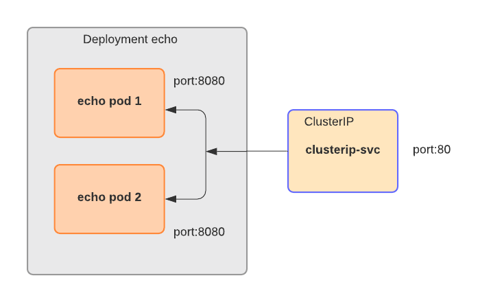

# ClusterIP service
ClusterIP service is a default type of service in Kubernetes. It allows to combine several pods by exposing a single IP address and dispatching traffic between the pods. The service requires a pod selector to be able to detect the pods, and ports exposed by the pods.

```yaml
apiVersion: v1
kind: Service
metadata:
  name: clusterip-svc               # service name
spec:
  type: ClusterIP                   # type of the service (exposing port inside of a cluster)
  selector:                         # selection of pods
    app: clusterip                  # that belong to the service
  ports:
  - protocol: TCP
    port: 80                        # port exposed by the service
    targetPort: 8080                # port exposed by the pods
```
This folder contains two files: deployment.yaml for the creation of the pods and service.yaml for the creation of the service. The files implement following cluster:

Steps to deploy the cluster:
1. Create the pods:
```
$kubectl apply -f deployment.yaml
deployment.apps/echo created

$kubectl get pods
NAME                    READY   STATUS        RESTARTS   AGE
echo-579b87b6c7-74c7l   1/1     Running       0          7s
echo-579b87b6c7-mc24k   1/1     Running       0          7s
echo-579b87b6c7-vknp8   1/1     Running       0          7s
```
2. Create the service:
```
$kubectl apply -f service.yaml
service/clusterip-svc created

$kubectl get svc
NAME            TYPE        CLUSTER-IP      EXTERNAL-IP   PORT(S)   AGE
clusterip-svc   ClusterIP   100.67.26.168   <none>        80/TCP    12s
kubernetes      ClusterIP   100.64.0.1      <none>        443/TCP   9d
```
To check if the service works correctly start an interactiv pod with curl installed
```
kubectl run curl --image=radial/busyboxplus:curl -i --tty --generator=run-pod/v1

[ root@curl:/ ]$ curl 100.68.139.28
'Hello there!'
```