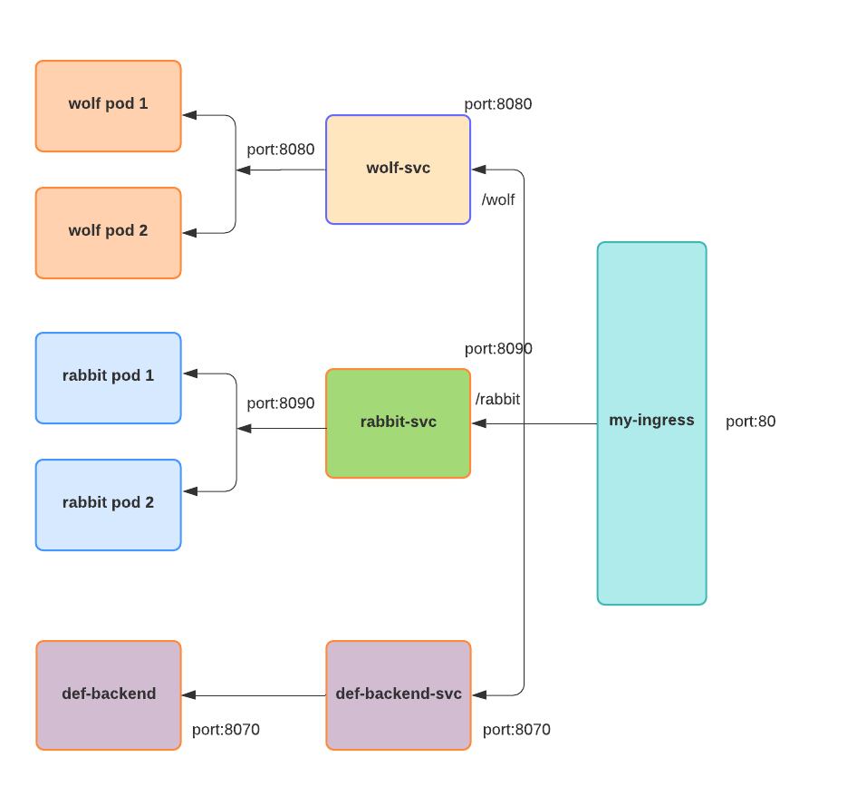

# Using Kubernetes Ingress object to forward trafic to a cluster 
According to [official kubernetes documentation](https://kubernetes.io/docs/concepts/services-networking/ingress/) Ingeress is an API object that manages access to the services in a cluster, typicaly HTTP. Ingress can provide load balancing, SSL termination and name based virtual hosting. In other words, you need Ingress if you want to expose your cluster fo ourside world. Ingress object allows to implement rules to define how exactly the trafic.
Here are some ingress-controllers:
- [GCP HTTP(S) Load Balancer (GCE)](https://cloud.google.com/load-balancing/docs/https/)
- [Nginx](https://github.com/kubernetes/ingress-nginx)
- [Contour](https://github.com/projectcontour/contour)
- [HAPROXY](https://github.com/haproxytech/kubernetes-ingress)
- [traefik](https://docs.traefik.io/providers/kubernetes-ingress/)
- [Istio](https://istio.io/docs/tasks/traffic-management/ingress/)
- [ALB Ingress Controller](https://docs.aws.amazon.com/eks/latest/userguide/alb-ingress.html)

This topic contains 2 files:
- deployment.yaml - creates 2 services (wolf-svc and rabbit-svc), each connected to 2 pods with echo servers.
- default-backend.yaml - creates a pod with a service for a default backend. All requests that cannot be properly routed go to the default backend.
- ingress.yaml - creates an Ingress object that implements following rulles:
   - /wolf requests are forwarded to service wolf-svc:8080
   - /rabbit requests are forwarded to service rabbit-svc:8090
   - all other requests are forwarded to the default backend



```yaml
apiVersion: extensions/v1beta1
kind: Ingress
metadata:
   name: my-ingress                 # name of the ingress object
spec:
   rules:
   - http:
      paths:
      - path: /wolf                 # route all /wolf requests to the wolf service
        backend:
         serviceName: wolf-svc      # name of the target service
         servicePort: 8080          # port of the target service
      - path: /rabbit               # route all /rabbit requests to the rabbit service
        backend:
         serviceName: rabbit-svc    # name of the target service
         servicePort: 8090          # port of the target service
```
To create the cluster with pods and service execute following command:
```
$ kubectl apply -f deployment.yaml
deployment.apps/wolfs created
service/wolf-svc created
deployment.apps/rabbits created
service/rabbit-svc created
```
Make sure that the pods and services are created correctly:

```
$ kubectl get svc
NAME         TYPE        CLUSTER-IP       EXTERNAL-IP   PORT(S)    AGE
kubernetes   ClusterIP   100.64.0.1       <none>        443/TCP    8d
rabbit-svc   ClusterIP   100.66.144.236   <none>        8090/TCP   9s
wolf-svc     ClusterIP   100.65.10.86     <none>        8080/TCP   10s


$ kubectl get pods
NAME                       READY   STATUS    RESTARTS   AGE
curl                       1/1     Running   3          2d3h
rabbits-66c5ddc4b7-9v4h2   1/1     Running   0          16s
rabbits-66c5ddc4b7-s9sqt   1/1     Running   0          16s
ubuntu                     1/1     Running   0          2d
wolfs-84dddfd99f-gmstv     1/1     Running   0          17s
wolfs-84dddfd99f-prcbj     1/1     Running   0          17s
```
Create the ingress object:
```
$ kubectl apply -f ingress.yaml

ingress.extensions/my-ingress created
```
Check if the ingress created correctly:

```
$ kubectl get ingress
NAME         HOSTS   ADDRESS                                                                   PORTS   AGE
my-ingress   *       a041a654408af11eaa19c0a7942f17bf-1087978017.eu-west-1.elb.amazonaws.com   80      61s
```
Now try to use the ingress and check if requests are routed correctly:
```
$ curl -L --insecure a041a654408af11eaa19c0a7942f17bf-1087978017.eu-west-1.elb.amazonaws.com/wolf
'Wolf server!'

$ curl -L --insecure a041a654408af11eaa19c0a7942f17bf-1087978017.eu-west-1.elb.amazonaws.com/rabbit
'Rabbit server!'
```
