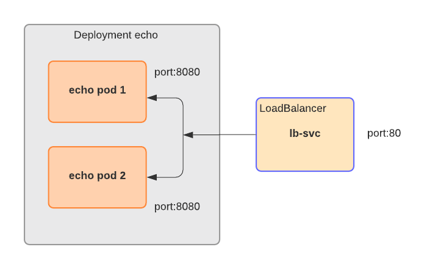

# LoadBalancer Service
LoadBalancer type of Service allows to leverage cloud specific load balancers to expose a Kubernetes cluster. Essentilal, it works as NodePort with external access powered by a load balancer from the cloud provider.

```yaml
apiVersion: v1
kind: Service
metadata:
  name: lb-svc                      # service name
spec:
  type: LoadBalancer                # type of the service (exposing port inside of a cluster)
  selector:                         # selection of pods
    app: load-balancer              # that belong to the service
  ports:
  - protocol: TCP
    port: 80                        # port exposed by the service
    targetPort: 8080                # port exposed by the pods
```

This folder contains following files:
- deployment.yaml - kubernetes manifest for deployment for 2 echo server pods
- load-balancr.yaml - kubernetes manifest for LoadBalancer service
The files implement followin cluster:


To deploy the cluster - start pod deployment:

```
$kubectl apply -f deployment.yaml
deployment.apps/echo created

$kubectl get deploy
NAME   READY   UP-TO-DATE   AVAILABLE   AGE
echo   2/2     2            2           61s

$kubectl get pods
NAME                   READY   STATUS    RESTARTS   AGE
echo-cd89f657f-cvb5w   1/1     Running   0          67s
echo-cd89f657f-rx54r   1/1     Running   0          67s
```
Start load balancer and display the service information to extract the service external address.
```
$kubectl apply -f load-balancer.yaml
service/lb-svc created

$kubectl get svc
NAME         TYPE           CLUSTER-IP      EXTERNAL-IP                                                               PORT(S)        AGE
kubernetes   ClusterIP      100.64.0.1      <none>                                                                    443/TCP        9d
lb-svc       LoadBalancer   100.65.189.80   a49973c1c105411eaa19c0a7942f17bf-1072362866.eu-west-1.elb.amazonaws.com   80:30642/TCP   18s
```
Test the load-balancer by sendig a HTTP request to the external endpoint:

```
$curl a49973c1c105411eaa19c0a7942f17bf-1072362866.eu-west-1.elb.amazonaws.com
'Hello there!'
```